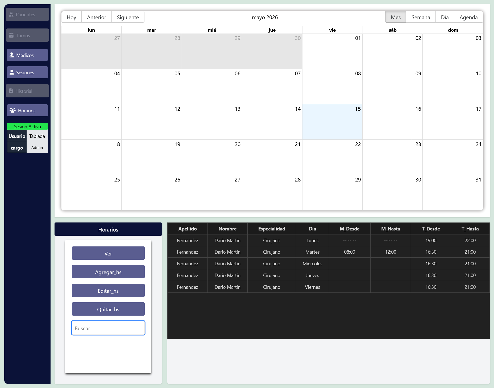
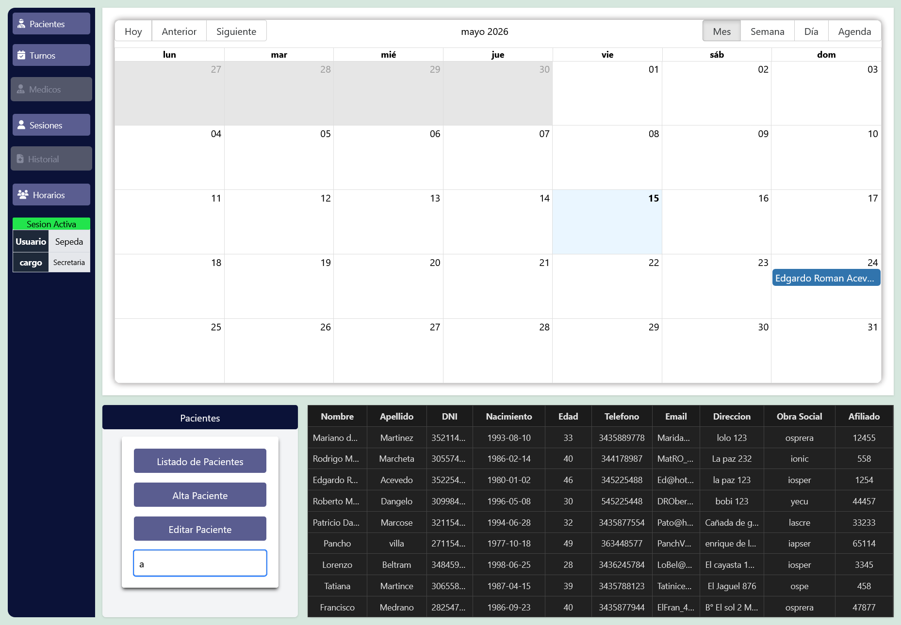
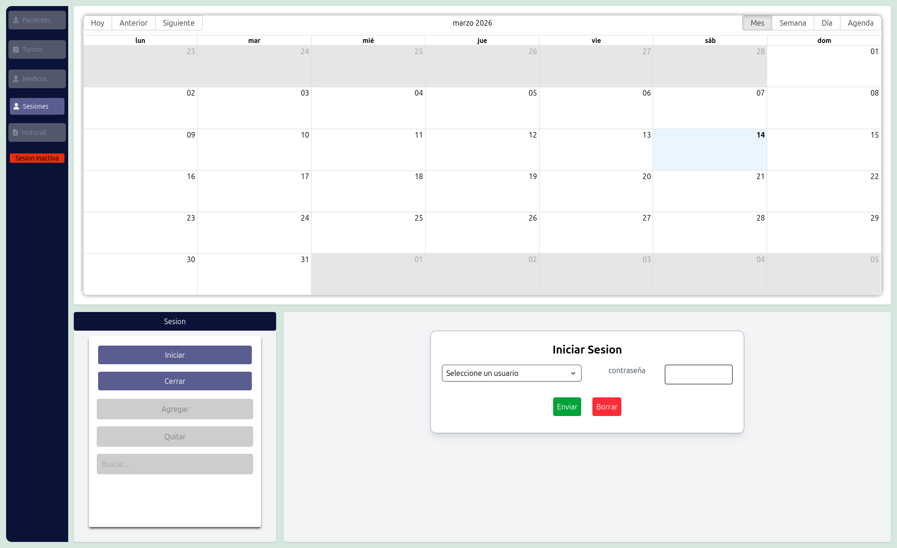
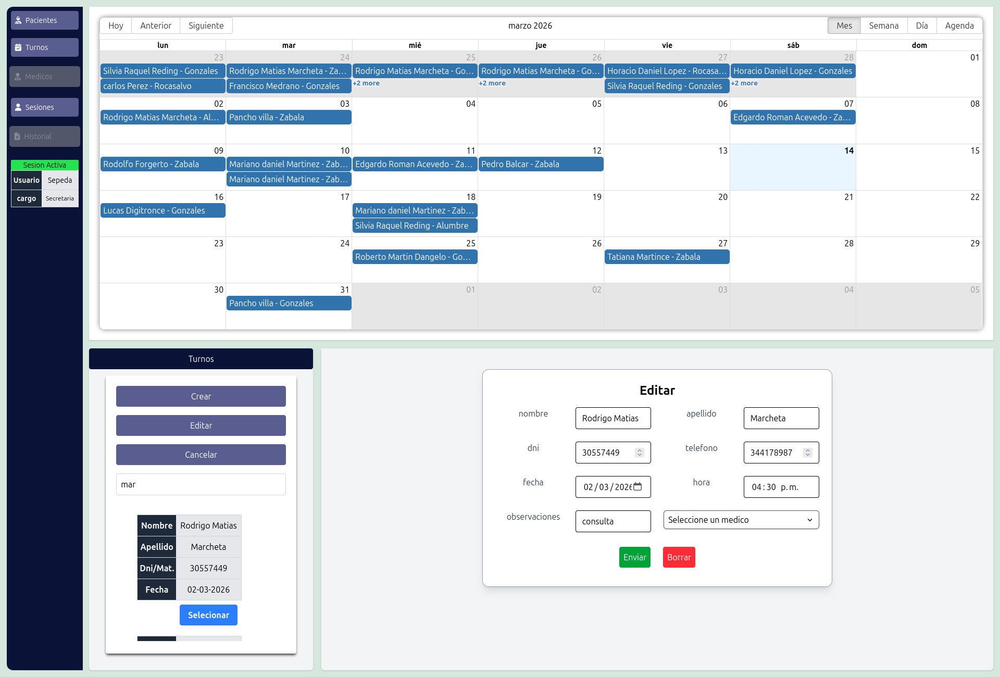
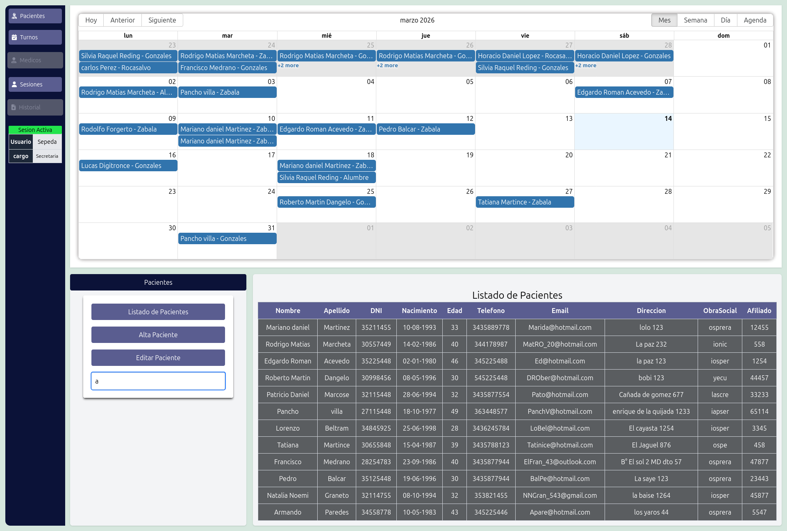
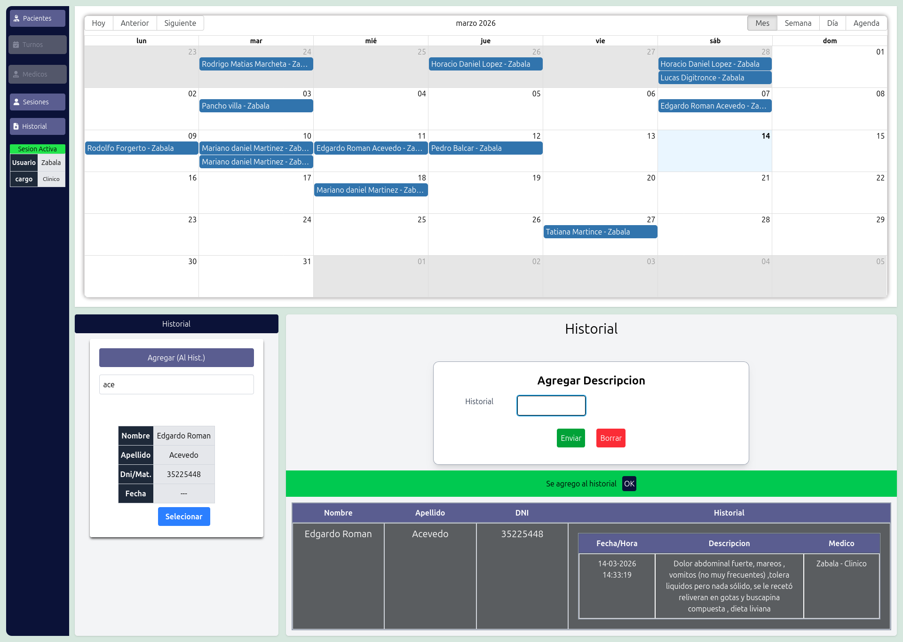

# Sistema de Gestión para Consultorios

Aplicación web diseñada para la gestión de turnos y registros clínicos en consultorios médicos.
El sistema permite administrar usuarios, médicos, pacientes, turnos y el historial clínico de cada paciente dentro de una red local.

El objetivo del proyecto es ofrecer una herramienta simple y eficiente para organizar el flujo de trabajo de un consultorio, permitiendo a médicos y secretarias gestionar turnos y registrar información clínica de forma ordenada.

---

## Características principales

* Gestión de **usuarios con roles** (admin, médico y secretaria)
* Creación y administración de **pacientes**
* **Calendario de turnos interactivo**
* Registro de **historial clínico por paciente**
* Actualización **en tiempo real de turnos** mediante sockets
* Sistema de **sesiones con Express**
* Aplicación pensada para ejecutarse en **red local (LAN)**

---

## Roles del sistema

### Admin

* Crear usuarios
* Registrar médicos
* Administrar el acceso al sistema

### Secretaria

* Registrar pacientes
* Crear y administrar turnos

### Médico

* Visualizar sus turnos
* Registrar observaciones en el historial del paciente

---

## Historial clínico

Cada registro en el historial de un paciente guarda:

* descripción de la consulta
* fecha y hora del registro
* médico que realizó la anotación
* cargo del médico

Esto permite mantener trazabilidad completa sobre quién registró cada información.

---

## 🆕 Últimas mejoras (v1.0.0)

- ✅ Sistema completo de **gestión de horarios de médicos**
  - Crear horarios
  - Editar horarios
  - Eliminar horarios
  - Visualización clara de disponibilidad


- 🔄 Mejora en la **visualización de la lista de pacientes**
  - Interfaz más limpia
  - Mejor experiencia de usuario


---

## 🧪 Estado del proyecto

🟢 Versión actual: **1.0.0**  
✔️ Proyecto funcional y terminado  
🔧 Posibles mejoras futuras en UI/UX y optimización

---


## Tecnologías utilizadas

### Frontend

* React
* Vite
* TypeScript
* React Big Calendar

### Backend

* Node.js
* Express
* Socket.IO
* express-session

### Base de datos

* SQLite

---
### Screenshots

### Sesion


### Edit Appoinment


### Patient List


### History add


## Arquitectura de datos

El sistema utiliza las siguientes entidades principales:

* **usuarios**
* **roles**
* **medicos**
* **pacientes**
* **turnos**
* **historial**

Relaciones principales:

* Un paciente puede tener **muchos turnos**
* Un médico puede tener **muchos turnos**
* Un paciente puede tener **muchos registros de historial**
* Los usuarios pueden estar vinculados a un médico mediante `medico_id`

---

## Instalación

Clonar el repositorio:

```
git clone https://github.com/tu-usuario/tu-repo.git
```

Instalar dependencias en backend y frontend:

```
npm install
```

Iniciar el servidor:

```
npm run dev
```

---

## Uso

El sistema está pensado para ejecutarse en una red local dentro de un consultorio.
Los usuarios acceden desde el navegador y trabajan sobre el mismo servidor central.

---

## Futuras mejoras

* Estados de turno (confirmado, en consulta, cancelado, etc.)
* Auditoría de acciones del sistema
* Mejoras en la gestión del historial clínico
* Exportación de datos

---

## Autor

Pablo César Zabala
Desarrollador Full Stack
